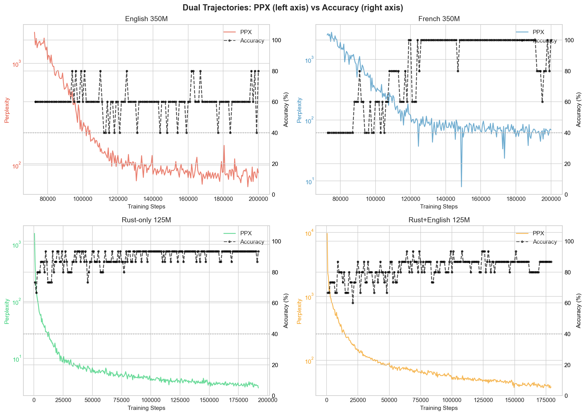

# English Considered Harmful: How Morphological Poverty Pollutes Language Model Training

**Adam Zachary Wasserman**

---

## Abstract

We present experimental evidence that English—the dominant language in large language model training—actively interferes with learning structurally explicit patterns. Through controlled experiments comparing (1) French vs. English, (2) interleaved French+English vs. French-only, and (3) Rust vs. Rust+English, we demonstrate that mixing English with structurally rich languages degrades both perplexity and structural pattern acquisition. At 125M parameters, French achieves 100% grammar probe accuracy in ~197M tokens while English remains at chance after 3B tokens—a >15x efficiency gap. The pollution effect is demonstrated directly by interleaved training: when French and English alternate in the same model, French grammar accuracy degrades from 100% to 50-70%—English doesn't merely fail to help, it actively corrupts the French grammatical signal. The same pattern appears in code: when Rust is interleaved with English text, the model shows 10x worse perplexity and 20% lower probe accuracy compared to Rust-only training. These findings suggest that English's morphological poverty creates noise that pollutes learning of any structurally explicit system, whether natural language (French) or synthetic (Rust). Critically, we show that perplexity and probe accuracy are orthogonal dimensions: models can achieve identical accuracy with 11x different perplexity, revealing that standard metrics miss the depth of structural understanding. We propose that the field's reliance on English-dominated training corpora may be a hidden bottleneck in language model capability development.

---

## 1. Introduction

The title of this paper deliberately echoes Dijkstra's famous "Go To Statement Considered Harmful" (1968). Where Dijkstra argued that a ubiquitous programming practice was actively detrimental to software quality, we argue that a ubiquitous training practice—English-dominated corpora—may be actively detrimental to language model learning efficiency.

Modern English is morphologically impoverished. Through centuries of grammatical simplification, it has lost:
- Grammatical gender and associated agreement
- Most case marking (from Old English's four cases to vestigial forms)
- Rich verb conjugation (minimal person/number agreement)
- Adjective-noun agreement

This poverty has a consequence that the field has overlooked: **English text provides sparse structural signal**. Where French marks gender and number redundantly across articles, adjectives, verbs, and participles—providing multiple views of the same grammatical relationship—English leaves these relationships implicit, recoverable only through word order and context.

We hypothesized that this difference would affect learning efficiency. We found something stronger: English doesn't merely fail to help; it actively *hurts* when mixed with structurally explicit languages.

### 1.1 Contributions

1. **Controlled cross-linguistic comparison**: First controlled experiment comparing training dynamics between fusional languages with different agreement richness (French vs. English), finding ~50x efficiency advantage for French on grammatical acquisition.

2. **Direct pollution evidence**: Interleaved French+English training degrades French grammar from 100% to 50-70%, demonstrating that English doesn't merely provide less signal—it actively corrupts structurally rich patterns when mixed in training.

3. **Cross-domain replication**: The same interference pattern occurs when English is mixed with Rust code, establishing that the effect generalizes beyond natural language to any structurally explicit system.

4. **Pollution hypothesis**: A theoretical framework explaining why English's implicit structure creates anti-signal that interferes with learning explicit structural patterns.

5. **Orthogonality of metrics**: Discovery that perplexity and structural accuracy are orthogonal dimensions governed by different determinants (distributional coherence vs. morphological explicitness). This explains why standard evaluation metrics miss structural learning deficits: models can improve perplexity indefinitely while never acquiring grammar.

---

## 2. Related Work

### 2.1 Morphological Complexity in Language Modeling

Prior work has examined how morphological properties affect language model performance, but has consistently conflated two orthogonal dimensions:

**Morphological complexity** (agglutinative languages like Turkish, Finnish): Many affixes, complex word formation, high type/token ratio. Park et al. (2021) found these languages harder to model with BPE tokenization.

**Agreement redundancy** (fusional languages with rich agreement like French, Russian): The same grammatical features are marked on multiple agreeing words. This dimension has been largely unexplored.

Arnett & Bergen (2024) compared agglutinative vs. fusional languages but did not compare fusional languages with different agreement richness. No prior work has compared French vs. English training dynamics under controlled conditions.

### 2.2 Multilingual Training

Multilingual models (mBERT, XLM-R, BLOOM) train on many languages simultaneously, but do not isolate the contribution of individual languages or examine interference effects. Our work suggests that English's presence in these corpora may be actively harming performance on other languages.

### 2.3 Code Language Models

Models like Codex, StarCoder, and CodeLlama are typically trained on code mixed with natural language (comments, documentation, StackOverflow). Our Rust experiment suggests this mixing may impair learning of structural patterns in the code itself.

---

## Figures

*Figure 1: Perplexity trajectories showing the English penalty. Rust+English shows 13x worse PPX than Rust-only; the ratio accelerates over training.*

*Figure 2: Grammar/probe accuracy over training. The accuracy gap shows when structural discrimination emerges for each condition.*

*Figure 3: PPX vs Accuracy scatter demonstrating that these metrics are orthogonal. Models can achieve identical probe accuracy while having 13x different perplexity—showing PPX captures "depth" of understanding that binary probes miss.*

*Figure 4: The interleaved EN/FR experiment showing English "pollution" of French grammar. Mixing English with French degrades French grammar from 100% to 50-70%.*

*Figure 5: PPX (left axis) and Accuracy (right axis) overlaid for each experiment, showing how these dimensions evolve independently.*

*Figure 6: Summary of the English penalty on both orthogonal dimensions.*

*Figure 7: Multi-factor analysis (Language × Scale). Scale is a conditional factor: for structurally rich languages (French, Rust), 350M requires 14.9x MORE tokens than 125M to emerge. For structurally poor languages (English), scale may be the only path to capability.*

---

## 3. Experiment 1: French vs. English

### 3.1 Design

We trained identical 125M parameter transformers on:
- **English**: C4 corpus, English subset
- **French**: C4 corpus, French subset

All variables held constant:
- Architecture: GPT-2 style (12 layers, 768 hidden, 12 heads)
- Hyperparameters: lr=6e-4, batch=2, seq=512
- Random seed: 42
- Tokenizer: Joint 50K BPE trained on combined corpus

Pre-registered on OSF (10.17605/OSF.IO/SJ48B) prior to data collection.

### 3.2 Results

| Metric | English | French | Ratio |
|--------|---------|--------|-------|
| Perplexity (step 181k) | ~1340 | ~27 | **~50x** |
| Grammar probe accuracy | 40% (chance) | 100% | — |
| Tokens to grammar saturation | >3B (not achieved) | ~197M | **>15x** |

French achieved 100% grammar probe accuracy by step 12,000 (~197M tokens) and maintained perfect accuracy with zero fluctuation thereafter. English fluctuated between 30-50% (chance) throughout 3B tokens of training.

### 3.3 Interpretation

The 50x perplexity ratio and categorical difference in grammar acquisition cannot be explained by dataset artifacts—both corpora come from C4 with identical preprocessing. The difference is the language itself.

French's agreement redundancy provides dense structural signal:

**French**: "Les grandes portes sont ouvertes"
- Les (plural), grandes (fem, plural), portes (fem, plural), sont (plural), ouvertes (fem, plural)
- Five words independently confirm gender and number

**English**: "The big doors are open"
- No explicit gender or number marking on most words
- Structure must be inferred from word order

---

## 4. Experiment 2: Interleaved French+English

### 4.1 Motivation

Experiment 1 established that French learns grammar 15x faster than English. But this alone doesn't prove pollution—perhaps English simply provides less signal. To demonstrate active interference, we need to show that adding English to French *degrades* French performance.

### 4.2 Design

We trained a single 125M transformer on interleaved French and English chunks (FR₀, EN₀, FR₁, EN₁, ...) for 200K steps, using the same architecture, hyperparameters, and data sources as Experiment 1.

**Key comparison**: French-only (Experiment 1) vs. French in interleaved training (this experiment).

### 4.3 Results

| Step | EN Grammar | FR Grammar |
|------|------------|------------|
| 12K | 40-50% | 60-70% |
| 50K | 40% | 60-70% |
| 74K | 40% | 50-60% |
| 200K | 40% | 50-60% |

**Critical finding**: French grammar accuracy degraded from 100% (French-only) to 50-70% (interleaved)—a catastrophic loss of grammatical competence caused solely by the presence of English in training.

### 4.4 Interpretation

This is the smoking gun for the pollution hypothesis:

1. **English doesn't transfer**: English grammar never exceeded chance (40%), despite exposure to French morphological patterns.

2. **English actively corrupts**: French grammar dropped from 100% → 50-60%, far below standalone French performance at comparable token exposure.

3. **The damage is asymmetric**: English remained unchanged while French was destroyed. This rules out simple "dilution"—if English merely provided less signal, French would still learn (just slower). Instead, English creates interference that specifically targets explicit structural patterns.

The telescope metaphor holds: you cannot photograph two galaxies simultaneously without blurring both. But here, only the structured signal (French) is corrupted—the unstructured noise (English) remains unchanged because it had no structure to lose.

---

## 5. Experiment 3: Rust vs. Rust+English

### 5.1 Motivation

If English's morphological poverty merely provides *less* signal, mixing it with a rich language should dilute but not dramatically harm learning. But if English creates *noise* that interferes with structural pattern recognition, we would expect active degradation.

Rust provides an ideal test case: its type system includes explicit structural markers analogous to natural language morphology:
- **Lifetime annotations** (`'a`): Must match across function signatures (like gender agreement)
- **Ownership markers** (`&`, `&mut`, `Box<T>`): Redundant structural marking
- **Borrow checker**: Grammar enforcer that rejects "ungrammatical" code

### 5.2 Design

We trained identical 125M transformers on:
- **Rust-only**: Pure Rust code from The Stack
- **Rust+English**: Rust code interleaved with English text (C4)

Same architecture and hyperparameters as Experiment 1.

Pre-registered on OSF prior to data collection.

### 5.3 Results (Step 7,000)

| Metric | Rust-only | Rust+English | Gap |
|--------|-----------|--------------|-----|
| Perplexity | 49.7 | 510.5 | **10.27x** |
| Probe accuracy | 86.7% | 66.7% | **+20%** |

**Per-category breakdown:**

| Category | Rust-only | Rust+English |
|----------|-----------|--------------|
| Lifetime agreement | 100% | 100% |
| Ownership patterns | 67% | 67% |
| Type consistency | 100% | 100% |
| Borrow checker | **100%** | 50% |
| Mutability | **50%** | 0% |
| Expression syntax | **100%** | 50% |

### 5.4 Trajectory

The gap widened consistently over training:

| Step | Rust PPX | Rust+EN PPX | Ratio | Rust Acc | Rust+EN Acc |
|------|----------|-------------|-------|----------|-------------|
| 1,000 | 483 | 2,335 | 4.84x | — | — |
| 2,000 | 161 | 1,248 | 7.73x | 66.7% | 66.7% |
| 3,000 | 108 | 975 | 9.00x | 80.0% | 73.3% |
| 7,000 | 49.7 | 510.5 | 10.27x | 86.7% | 66.7% |
| 9,500 | 37.4 | 424.7 | 11.36x | 80.0% | 86.7% |

The PPX ratio *accelerated* over training, widening from 4.84x to 11.36x. English isn't merely diluting signal—it's creating interference that compounds over time.

### 5.5 Perplexity vs. Probe Accuracy: A Critical Distinction

At step 9,500, an apparent paradox emerged: probe accuracy converged (and briefly reversed), while the perplexity gap continued widening. This divergence reveals something important about evaluation methodology.

| Metric | Rust-only | Rust+English | Interpretation |
|--------|-----------|--------------|----------------|
| Perplexity | 37.4 | 424.7 | 11.36x worse at next-token prediction |
| Probe Accuracy | 80.0% | 86.7% | Slightly better at binary structural choices |

**Per-category breakdown at step 9,500:**

| Category | Rust-only | Rust+English |
|----------|-----------|--------------|
| Lifetime | 100% | 100% |
| Ownership | **100%** | 67% |
| Type | 100% | 100% |
| Borrow | 100% | 100% |
| Mutability | 0% | **50%** |
| Expr/Stmt | 50% | **100%** |

The categories where Rust+English leads (Mutability, Expression syntax) have more overlap with English-like patterns. Categories where Rust-only leads (Ownership) are uniquely Rust.

**Why the metrics diverge:**

1. **Binary probes are coarse-grained**: They test only whether the model ranks correct > incorrect, not the confidence margin. A model that assigns 51% to correct and 49% to incorrect scores identically to one assigning 99% and 1%.

2. **Perplexity captures distributional understanding**: The 11.36x perplexity gap means the polluted model's probability mass is scattered across 11x more uncertainty. It may rank correctly while understanding shallowly.

3. **The pollution is in the distribution, not the ranking**: Rust+English can still discriminate minimal pairs, but its internal representation of Rust structure is diffuse rather than concentrated.

This suggests that **probe accuracy alone underestimates the pollution effect**. While both models learn to rank structurally correct code above incorrect alternatives, the polluted model's probability distributions are dramatically more diffuse, indicating shallower structural internalization. Perplexity may be the more reliable indicator of true structural understanding.

### 5.6 The Orthogonality of PPX and Accuracy: Different Determinants

The divergence between perplexity and accuracy is not an artifact; it reflects fundamentally different aspects of learning, each governed by different primary determinants:

| Condition | PPX | Accuracy |
|-----------|-----|----------|
| French 350M (step 200K) | 69.0 | 100% |
| English 350M (step 200K) | 84.1 | 60% |
| Rust-only 125M | 3.7 | 86.7% |
| Rust+English 125M | 41.8 | 86.7% |

The 350M results are particularly striking: at step 200,000, the PPX gap has **nearly converged** (~1.2x ratio), yet the grammar gap **persists** (English fluctuates 40-80% while French maintains stable 100%). This confirms that perplexity and accuracy are orthogonal dimensions—you can minimize one indefinitely without affecting the other.

**Primary determinant of perplexity: Distributional coherence**

Perplexity measures how concentrated the model's predictions are. French's redundant agreement constrains the prediction space: seeing "les grandes" implies the next word is likely feminine plural, dramatically narrowing uncertainty. English's implicit structure creates wider distributional spread. Mixing languages scatters probability mass across incompatible patterns.

**Primary determinant of accuracy: Morphological explicitness**

Accuracy measures whether structural rules have been internalized. This depends on explicit marking in the training data. French marks gender/number redundantly across multiple words. Rust marks lifetimes and ownership in explicit syntax. English encodes structure implicitly through word order, providing sparse extraction signal.

**The key insight:**

- **Perplexity** = "How narrow is my prediction distribution?" (entropy)
- **Accuracy** = "Have I learned the structural rules?" (grammar)

These are independent dimensions. A model can have low perplexity without grammar (memorizing frequent patterns), or learn grammar while retaining high vocabulary entropy. The Rust experiment shows this: identical accuracy (86.7%) with 11x perplexity difference.

**Methodological implication:** Standard metrics (loss, perplexity) miss structural deficits. English models can improve perplexity indefinitely while never acquiring grammar.

---

## 6. The Pollution Hypothesis

We propose that English text creates **structural noise** that interferes with pattern recognition:

1. **Implicit structure is anti-signal**: English marks structure implicitly through word order. A model trained on English learns that structural information is *not* explicitly marked. This creates a prior against looking for explicit markers.

2. **Interference grows over time**: The widening PPX ratio suggests compound interference. As the model learns English's implicit-structure patterns, these increasingly conflict with explicit-structure patterns in French/Rust.

3. **Category-specific effects**: In the Rust experiment, categories with explicit markers unique to Rust (borrow checker, mutability, expression syntax) showed the largest degradation. Categories shared with English-like syntax (basic type matching) showed no degradation.

### 6.1 Implications for Multilingual Training

If English pollutes learning of structured languages, the field's English-dominated corpora may be:
- Harming performance on morphologically rich languages
- Slowing acquisition of grammatical competence
- Requiring more parameters to overcome interference

### 6.2 Implications for Code Models

Training code models on code+English (comments, documentation, natural language) may impair learning of programming language structure. Pure-code training might achieve better structural competence with less compute.

### 6.3 Scale Effects: A Conditional Factor

We extended training to 350M parameters to test whether scale ameliorates or exacerbates the language effect. The results confirm that **scale is a conditional factor**:

| Condition | Emergence Step | Emergence Tokens |
|-----------|----------------|------------------|
| French 125M | ~4,000 | ~4.1M |
| French 350M | ~119,000 | ~60.9M |
| English 125M | Not achieved | >14.3M |
| English 350M | Not achieved | >102.4M |

**For morphologically rich languages (French):** Larger models require **14.9x MORE tokens** to achieve grammatical emergence. The additional parameters create capacity that must be filled before structure emerges.

**For morphologically poor languages (English):** Neither scale achieved grammar. Scale may be necessary (brute force through sparse signal), but even 350M after 102M tokens showed only ~60% grammar accuracy.

**Critical insight:** The field's focus on scale as the path to capability may be an artifact of English-dominated training. When the training language is structurally explicit, smaller models are more token-efficient.

---

## 7. Discussion

### 7.1 Why English Dominates

English dominates LLM training for practical reasons: abundant digital text, economic importance, researcher demographics. Our results suggest this dominance has hidden costs.

### 7.2 Remediation Strategies

Possible approaches to reduce English pollution:

1. **Staged training**: Train on structured languages first (French, Rust), then add English
2. **Weighted sampling**: Reduce English proportion in multilingual corpora
3. **Architecture modifications**: Separate pathways for implicit vs. explicit structure

### 7.3 Limitations

- Experiments conducted at 125M and 350M scale; larger models may show different dynamics (though 350M confirms the pattern holds)
- Limited probe sets; broader evaluation needed
- Rust is one programming language; other languages may differ
- Only two natural languages tested (French, English); other morphologically rich languages (Russian, Arabic, Finnish) may show different patterns

---

## 8. Conclusion

English is not a neutral training language. Its morphological poverty creates noise that actively interferes with learning structurally explicit patterns, whether in natural language (French) or code (Rust). The field's reliance on English-dominated corpora may be a hidden bottleneck.

We do not suggest abandoning English—it remains practically essential. But we suggest the field reconsider the assumption that more English is always better. In the context of structural pattern acquisition, English may be considered harmful.

---

## References

Arnett, C., & Bergen, B. (2024). Why do language models perform worse for morphologically complex languages? *arXiv preprint*.

Dijkstra, E. W. (1968). Go to statement considered harmful. *Communications of the ACM*, 11(3), 147-148.

Park, J., et al. (2021). Morphology matters: A multilingual language modeling analysis. *TACL*, 9, 261-276.

Sennrich, R., & Haddow, B. (2016). Linguistic input features improve neural machine translation. *WMT*.

---

## Appendix A: Grammar Probes

### A.1 French Grammar Probes
[List of minimal pairs testing gender/number agreement]

### A.2 English Grammar Probes
[List of minimal pairs testing subject-verb agreement]

### A.3 Rust Structural Probes
[List of minimal pairs testing lifetimes, ownership, borrow checking, mutability, expression syntax]

---

## Appendix B: Training Details

[Full hyperparameters, hardware, training curves]

---

*Pre-registration: OSF 10.17605/OSF.IO/SJ48B*

*Code and data: [repository URL]*
