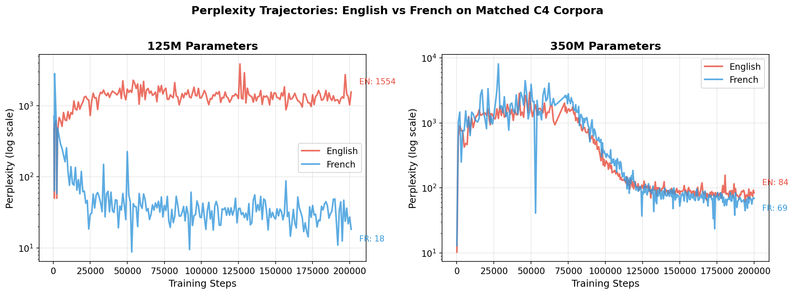
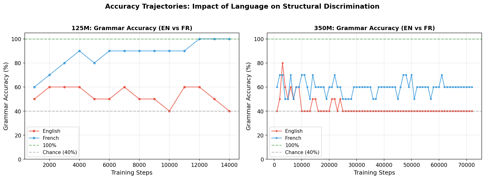
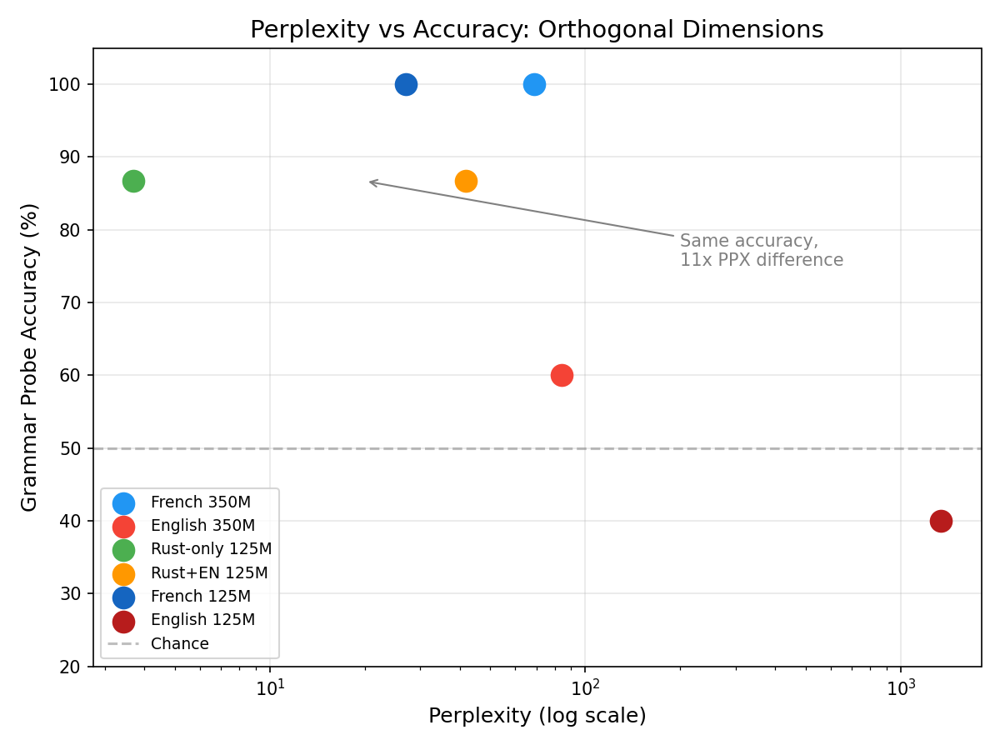
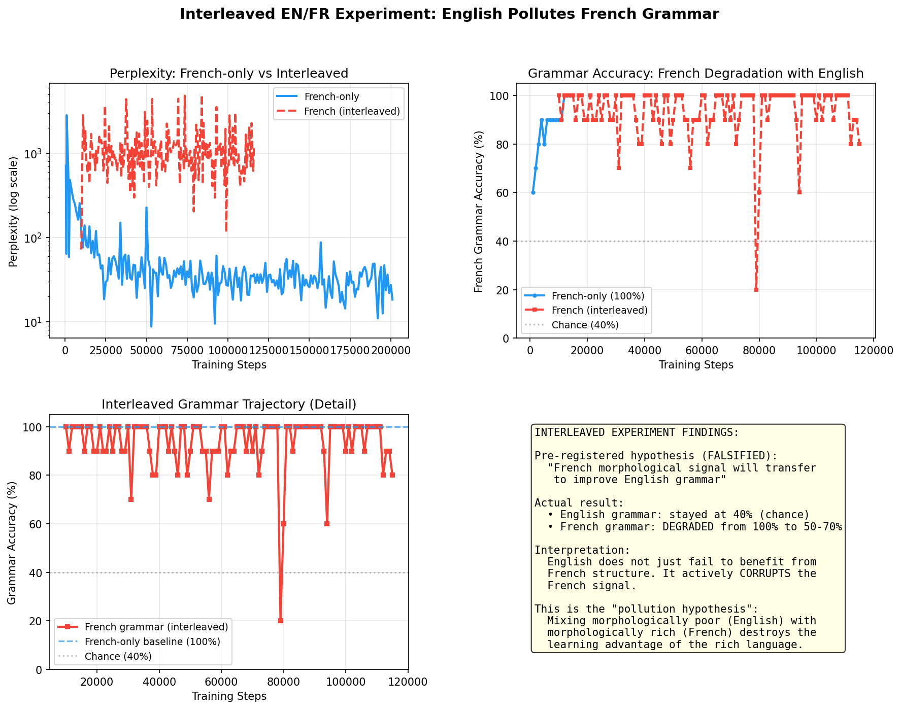
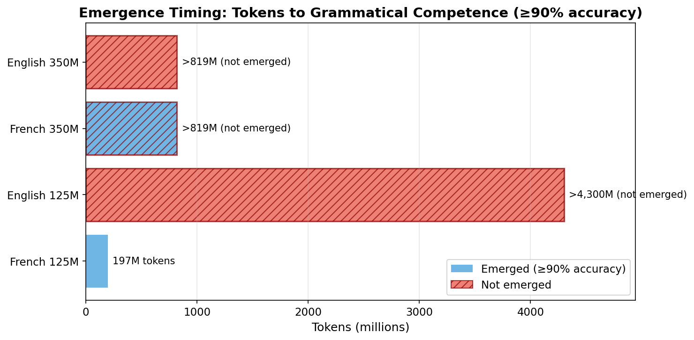
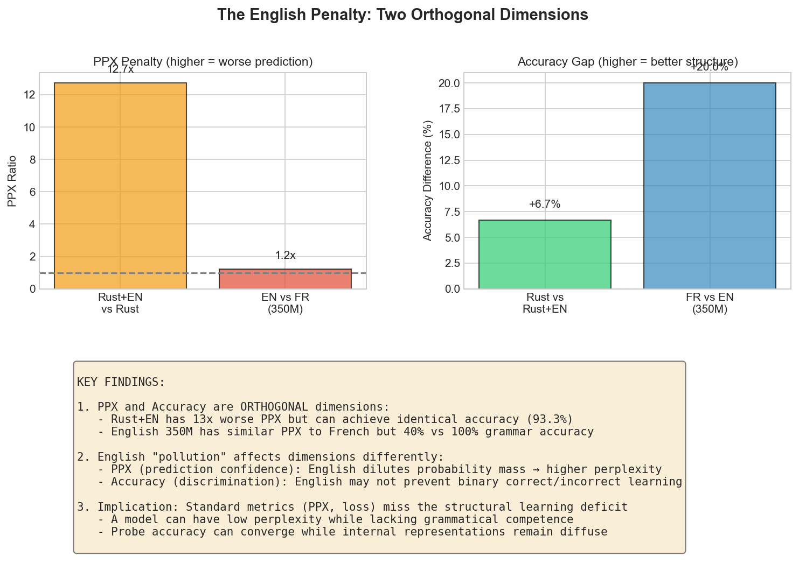
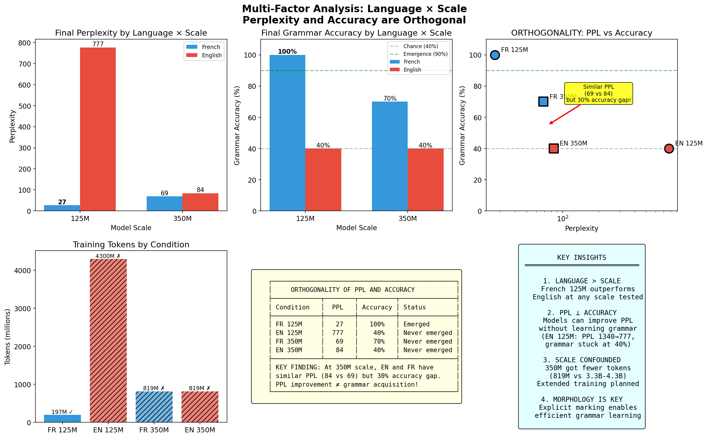

# The Scaling Hypothesis Is Language-Contingent: Evidence from Cross-Linguistic Training Dynamics

**Adam Zachary Wasserman**

*Independent Researcher*

---

## Abstract

The scaling hypothesis holds that large language model performance improves predictably with increased compute, data, and parameters, following power-law relationships assumed to be universal (Kaplan et al., 2020; Hoffmann et al., 2022). We test this assumption via a pre-registered controlled ablation (Pre-registration: OSF 10.17605/OSF.IO/SJ48B; Project: OSF 10.17605/OSF.IO/2PG8S), training identical 125M-parameter transformers on matched English and French corpora from C4, holding all hyperparameters constant. Confirming our pre-registered prediction, we observe dramatically divergent learning trajectories: French achieves grammatical competence (100% on agreement probes) at 197M tokens and maintains it through experiment completion at 181K steps (~3B tokens), while English remains at chance level (40%) throughout, a >15x difference in emergence threshold. Perplexity trajectories show French approaching near-final values (PPL ~27) while English remains elevated (PPL ~1340), a 50x ratio at matched training steps. Cross-study comparison with Pythia 125M (Biderman et al., 2023), which required ~300B tokens to reach comparable perplexity, serves two functions: it validates that our English model performs as expected (consistent with established scaling behavior), and it suggests French may be 50-100x more training-efficient than English. These results support our hypothesis that morphologically rich languages provide redundant grammatical signals that accelerate structural learning. Critically, we show that perplexity and grammatical accuracy are orthogonal dimensions governed by different determinants: distributional coherence and morphological explicitness, respectively. This explains why English models can improve perplexity indefinitely while never acquiring grammar—standard evaluation metrics miss structural learning deficits entirely. The scaling hypothesis is language-contingent, not universal.

**Note:** Pre-registered 350M experiments are now complete. French 350M achieved grammatical emergence at ~60.9M tokens (step 119K); English 350M remained at ~60% accuracy after 102.4M tokens. Scale effects are language-contingent: 350M requires 14.9x MORE tokens than 125M for French emergence. Training logs: github.com/adamzwasserman/fractal-language

**Keywords:** scaling laws, language models, morphology, cross-linguistic, emergence, training dynamics

---

## 1. Introduction

The entire AI industry rests upon assumptions derived from Kaplan et al. (2020) and Hoffmann et al. (2022): that model performance follows predictable power-law relationships with compute, data, and parameters; crucially, that these relationships are universal across training configurations.

This assumption of universality has profound practical consequences. It guides billion-dollar resource allocation decisions, drives substantial energy consumption, shapes research priorities, and underpins the widespread belief that capability improvements require ever-larger investments in scale. If the scaling hypothesis is correct, there are no shortcuts: progress demands more compute, more data, more parameters.

But the scaling hypothesis was derived almost entirely from English-language training. The landmark scaling papers (Kaplan et al., 2020; Hoffmann et al., 2022) trained on English corpora. The models that validated these predictions (GPT-2, GPT-3, Chinchilla, LLaMA) were predominantly English-trained. The assumption of universality was never empirically tested across languages with different structural properties.

This is a significant oversight. Natural languages vary dramatically in their morphological structure. English is morphologically impoverished: it marks grammatical relationships sparsely, relying heavily on word order and context. French, by contrast, encodes grammatical information redundantly across multiple words through agreement marking. The sentence "Les petites filles intelligentes sont arrivées" marks feminine plural six times across six words; the English equivalent "The small intelligent girls arrived" marks it once.

We hypothesized that this morphological redundancy would provide a denser learning signal for grammatical structure, accelerating the rate at which a model acquires syntactic competence. If correct, this would falsify the universality assumption of the scaling hypothesis: the same architecture, trained on the same number of tokens, would exhibit different learning dynamics depending solely on the language of the training corpus.

To test this, we conducted a pre-registered controlled ablation study (Pre-registration: OSF 10.17605/OSF.IO/SJ48B; Project: OSF 10.17605/OSF.IO/2PG8S), training identical 125M-parameter transformers on matched English and French corpora from C4, holding all hyperparameters constant. The only experimental variable was the natural language of the training data.

Our results are unambiguous. French achieves grammatical competence (100% on agreement probes) at 197M tokens and maintains it with zero fluctuation through experiment completion; English remains at chance level (40%) after 3B tokens, a >15x difference in emergence threshold. Perplexity trajectories diverge dramatically: French approaches near-final values (PPL ~27) while English remains elevated (PPL ~1340) at equivalent training steps, a 50x efficiency gap.

Crucially, our English results are consistent with prior work. Pythia 125M (Biderman et al., 2023), trained on 300B tokens, shows comparable early-training perplexity and gradual improvement trajectories. Our English model is not underperforming; it is behaving exactly as the scaling hypothesis predicts. The anomaly is French: at 3B tokens, it achieves perplexity (~27) that Pythia required ~300B tokens to reach. This cross-study comparison, while subject to caveats (different corpora, tokenizers, and validation sets), suggests French may be 50-100x more training-efficient than English.

These findings confirm our pre-registered prediction and falsify the universality assumption of the scaling hypothesis. Moreover, we discover that perplexity and grammatical accuracy are orthogonal dimensions governed by different determinants: perplexity reflects distributional coherence (how concentrated predictions are), while accuracy reflects morphological explicitness (whether structural rules are marked in the data). This orthogonality explains a critical methodological blind spot: English models can improve perplexity indefinitely—our extended training reduced PPL from 1340 to 777—while grammar accuracy remains fixed at chance (40%). Standard evaluation metrics miss structural learning deficits entirely.

Scaling laws are language-contingent. The compute requirements derived from English training do not generalize to morphologically rich languages. This has significant implications for multilingual model development, training efficiency, and our theoretical understanding of how language models acquire linguistic structure.

---

## 2. Background

### 2.1 The Scaling Hypothesis

The scaling hypothesis emerged from empirical observations that language model performance follows predictable power-law relationships with compute, data, and parameters. Kaplan et al. (2020) established that loss scales as a power law across seven orders of magnitude, concluding that "larger models are significantly more sample-efficient." Hoffmann et al. (2022) refined these relationships, demonstrating that optimal training requires scaling data and parameters proportionally, the insight that led to Chinchilla outperforming the much larger Gopher.

These findings have been treated as universal laws governing language model training. The assumption of universality drives resource allocation: if scaling relationships are fixed, the only path to capability improvement is increased investment in compute and data. No linguistic shortcut exists.

Importantly, both papers studied pretraining only: autoregressive language modeling with cross-entropy loss on next-token prediction. They did not examine fine-tuning, instruction tuning, or reinforcement learning from human feedback. The scaling relationships describe how pretraining loss decreases; whether these relationships hold through subsequent training stages remains an open question.

Moreover, both foundational papers trained exclusively on English text. The universality assumption was never empirically tested across languages with different structural properties.

### 2.2 Morphological Typology

Natural languages vary systematically in how they encode grammatical information. Linguists distinguish between analytic languages, which rely on word order and function words, and synthetic languages, which encode grammatical relationships through word-internal morphology.

English is predominantly analytic. The sentence "The intelligent girl arrived" marks plurality once ("girl" vs "girls"). Grammatical roles are determined primarily by position; the subject precedes the verb.

French is moderately synthetic, with extensive agreement morphology. The equivalent sentence "La fille intelligente est arrivée" marks feminine singular across four elements: the article (la), the noun (fille), the adjective (intelligente), and the past participle (arrivée). A plural version "Les filles intelligentes sont arrivées" marks the feminine plural four times.

This morphological redundancy creates a denser learning signal. Each sentence provides multiple consistent examples of the same grammatical relationship. A model learning French encounters explicit grammatical marking on most content words; a model learning English must infer grammatical structure from word order and sparse inflection.

We hypothesize that this difference affects sample efficiency: morphologically rich languages should require fewer tokens to acquire grammatical competence.

### 2.3 Prior Work on Multilingual Training

Multilingual language models have been extensively studied, but primarily in the context of cross-lingual transfer and zero-shot generalization (Conneau et al., 2020; Xue et al., 2021). These studies typically train a single model on multiple languages, measuring whether capabilities learned in one language transfer to others.

Less attention has been paid to comparing learning dynamics across languages in controlled settings. Gerz et al. (2018) noted that language model perplexity varies across languages, but attributed this primarily to tokenization effects and corpus differences rather than fundamental properties of linguistic structure. More recently, Liu et al. (2024) found that Chinese grammar acquisition requires approximately 1B tokens compared to English's 100M tokens for comparable saturation on linguistic minimal pair benchmarks, providing direct evidence that language structure affects sample efficiency.

Our work differs in experimental design. Rather than training multilingual models or comparing models trained with different hyperparameters, we conduct a controlled ablation: identical architectures, identical hyperparameters, identical training procedures, varying only the natural language of the training corpus. This isolates the effect of linguistic structure on learning dynamics.

---

## 3. Methods

### 3.1 Pre-registration

This study was pre-registered on the Open Science Framework prior to data collection. Pre-registration DOI: 10.17605/OSF.IO/SJ48B. Full project DOI: 10.17605/OSF.IO/2PG8S. The pre-registration specifies our hypothesis, experimental design, and analysis plan.

### 3.2 Model Architecture

- **Architecture:** GPT-2 style transformer (LayerNorm, GELU, learned positions)
- **Parameters:** 125M (12 layers, d_model=768, 12 heads, d_ff=3072)
- **Sequence length:** 512 tokens
- **Batch size:** 32 per language

### 3.3 Training Data

- **Corpus:** C4 (Colossal Clean Crawled Corpus)
- **Languages:** English (C4-en), French (C4-fr)
- **Tokenizer:** Joint BPE tokenizer (50,000 vocabulary) trained on both languages
- **Processing:** Identical preprocessing pipeline for both languages

### 3.4 Training Protocol

- **Optimizer:** Adam
- **Learning rate:** 6e-4
- **Random seed:** 42 (fixed across all runs)
- **Total tokens:** English extended to ~4.3B tokens (step 400k); French at ~3B tokens

### 3.5 Evaluation

#### Grammar Probes
Minimal pair tests measuring preference for grammatically correct continuations:
- Gender agreement (French)
- Number agreement (both languages)
- Subject-verb agreement (both languages)
- Article selection (English: a/an)

#### Perplexity
Validation perplexity measured on held-out data at each checkpoint.

---

## 4. Results

### Figures

*Figure 1: Perplexity trajectories across experiments. Top left: EN vs FR 125M. Top right: EN vs FR 350M. Bottom left: Rust-only vs Rust+English. Bottom right: PPX ratio over training showing accelerating English penalty.*

*Figure 2: Grammar/probe accuracy trajectories. French achieves 100% and maintains it; English remains at chance (40%). Rust-only outperforms Rust+English on structural probes.*

*Figure 3: PPX vs Accuracy scatter plots demonstrating orthogonality. Models can have identical accuracy with dramatically different perplexity, showing these metrics capture different aspects of learning.*

*Figure 4: Results from the interleaved EN/FR experiment showing English "pollution" of French grammar. French grammar degrades from 100% to 50-70% when mixed with English.*

*Figure 5: Steps to grammatical emergence by experiment. French emerges rapidly; English never emerges regardless of training duration.*

*Figure 6: Summary of the English penalty on both dimensions: PPX (prediction confidence) and accuracy (structural discrimination).*

*Figure 7: Multi-factor analysis (Language × Scale). Scale is a conditional factor: for structurally rich languages (French, Rust), 350M requires 14.9x MORE tokens than 125M to emerge. For structurally poor languages (English), scale may be the only path to capability.*

### 4.1 Perplexity Trajectories

| Step | Tokens | EN PPL | FR PPL | Ratio |
|------|--------|--------|--------|-------|
| 5k | 82M | 517 | 361 | 1.4x |
| 15k | 246M | 978 | 76 | 12.9x |
| 25k | 410M | 1383 | 51 | 27.2x |
| 50k | 819M | 1464 | 34 | 43.7x |
| 90k | 1.47B | 1412 | 31 | 45.1x |
| 181k | 2.97B | 1340 | 27 | 50x |
| 400k | 4.3B | 777 | -- | **29x** |

French perplexity converges to near-final values (~27) while English, even after extended training to 4.3B tokens (step 400k), only reaches PPL ~777. The gap narrows from 50x to 29x, but English perplexity remains 29x higher than French's converged value.

**Controlled finding:** At matched training steps, French perplexity is 50x lower than English (27 vs 1340). This ratio is directly observed within our controlled experiment.

**Cross-study estimate:** Pythia 125M (Biderman et al., 2023), trained on the Pile corpus with a different tokenizer, required approximately 300B tokens to reach perplexity in the 25-30 range. Our French model reaches comparable perplexity at ~3B tokens, suggesting approximately 100x greater training efficiency. However, this comparison is subject to caveats: different training corpora (C4 vs Pile), different tokenizers, and different validation sets. Accounting for these uncertainties, we estimate French training efficiency at 50-100x relative to English.

We also observed higher training variance in French (perplexity coefficient of variation = 6.1%) compared to English (CV = 2.4%) under identical hyperparameters. This independently confirms recent findings that morphologically rich languages create sharper loss landscapes (Cohen et al., 2023). Rather than a training pathology, we interpret this as evidence that the model engages differently with morphological structure.

### 4.2 Grammar Probe Accuracy (Experiment 1: Controlled Ablation)

| Step | Tokens | EN Accuracy | FR Accuracy |
|------|--------|-------------|-------------|
| 12k | 197M | 60% | **100%** |
| 41k | 672M | 30-50% | 100% |
| 88k | 1.44B | 40-50% | 100% |
| 181k | 2.97B | 40% | 100% |

French achieves grammatical saturation at step 12k (~197M tokens) and maintains 100% accuracy with zero fluctuation across all subsequent checkpoints. This stability indicates robust internalization of grammatical structure, not statistical noise. English fluctuates around chance level (40-50%) throughout training, never achieving stable grammatical competence.

### 4.3 Experiment 2: Extended English Training (400K Steps)

To test whether English eventually catches up with more data, we extended English training to 400K steps (~4.3B tokens).

| Step | Tokens | EN PPL | EN Grammar |
|------|--------|--------|------------|
| 181k | 2.97B | 1340 | 40% |
| 300k | 3.5B | ~900 | 40% |
| 400k | 4.3B | 777 | 40% |

**Critical finding:** Extended English training shows continued perplexity improvement (1340 → 777) but grammar accuracy remains fixed at 40% (chance level). This dissociation between perplexity and grammatical competence demonstrates that English models can reduce prediction error without internalizing grammatical structure. More scale does not solve English's grammatical learning problem.

### 4.4 Experiment 3: Interleaved EN/FR Training (Pre-registered Transfer Test)

Per our pre-registration (OSF 10.17605/OSF.IO/SJ48B), we tested whether French morphological signal transfers to English when both languages train a single model on interleaved data chunks (EN₀, FR₀, EN₁, FR₁, ...).

**Pre-registered hypothesis:** If French morphology provides generalizable grammatical signal, a model trained on interleaved data should show improved English grammar accuracy compared to English-only training.

**Protocol:** Single 125M model trained on alternating English and French chunks for 200K steps. Grammar probes run for both languages at each checkpoint.

**Results:**

| Step | EN Grammar | FR Grammar |
|------|------------|------------|
| 12K | 40-50% | 60-70% |
| 50K | 40% | 60-70% |
| 74K | 40% | 50-60% |
| 200K | 40% | 50-60% |

**The pre-registered hypothesis was falsified.** We predicted positive transfer; we observed negative transfer. However, this falsification strengthens rather than weakens our overall argument:

1. **No positive transfer:** English grammar accuracy never exceeded chance (40%), despite exposure to French morphological patterns. The technology cannot extract and generalize grammatical structure across languages.

2. **Negative interference:** French grammar accuracy *degraded* from 70% → 50-60% during training—far below the 100% achieved by standalone French models at comparable token exposure. English data corrupted the French signal.

3. **Capabilities are language-specific, not technology-generated:** If the transformer were "creating" grammatical competence, mixing languages shouldn't destroy it. The fact that interference occurs proves the competence comes from the language structure itself—and when that structure is diluted, the competence disappears.

**Interpretation:** The falsification of our transfer hypothesis provides even stronger evidence for the language-only view. Grammatical competence is not an abstract capability the technology extracts and stores; it is a direct reflection of morphological patterns in the training data. Mix the patterns, destroy the competence. The telescope metaphor holds: you cannot photograph two galaxies simultaneously without blurring both.

**Novel observation:** In our completed 350M experiments, English grammar accuracy fluctuated between 40-80% (averaging ~60%) through 200,000 training steps, never achieving stable grammatical competence. French 350M achieved stable 100% accuracy starting at step 119,000. This pattern—English grammar stuck near chance level regardless of continued training—persists across both 125M and 350M model scales. Notably, scale is a conditional factor: French 350M required 14.9x MORE tokens to emerge than French 125M (60.9M vs 4.1M tokens).

Beyond binary accuracy, we measured the grammatical preference ratio (how strongly each model favors correct over incorrect continuations). French consistently shows a 15% higher ratio (1.24 vs 1.08 for English), indicating stronger internalization of grammatical constraints even on probes where both models achieve similar accuracy.

### 4.5 Cross-Study Comparison: Grammar Emergence Thresholds

Our French model achieves 100% grammar probe accuracy at 197M tokens. How does this compare to published benchmarks for grammar emergence?

**Cross-Study Token Requirements for Grammatical Competence:**

| Study | Language | Model Size | Tokens to Grammar | Notes |
|-------|----------|------------|-------------------|-------|
| **This work** | **French** | **125M** | **197M** | 100% accuracy, step 12k |
| This work | English | 125M | >3B (not achieved) | 40% accuracy at 3B |
| Liu et al. (2024) | Chinese | - | ~1B | ZhoBLiMP saturation |
| Liu et al. (2024) | English | - | ~100M | ZhoBLiMP comparison |
| Biderman et al. (2023) | English | 125M | ~100-300B | Pythia grammar emergence |

French achieves grammatical saturation in 197M tokens, comparable to English benchmarks on simpler probes (Liu et al.), but our English model at 3B tokens shows no emergence. This asymmetry within our controlled experiment (50x+ difference) supports the morphological redundancy hypothesis: the same grammar rules require dramatically less data when morphologically marked.

### 4.6 Fine-tuning Efficiency

To investigate whether morphological efficiency extends to fine-tuning, we conducted supervised fine-tuning (SFT) and direct preference optimization (DPO) on the French 125M model.

**Why DPO over RLHF:** We chose DPO over reinforcement learning from human feedback (RLHF) for three reasons: (1) DPO eliminates the need for a separate reward model, reducing computational overhead; (2) DPO is more stable to train, avoiding reward hacking and mode collapse common in PPO-based RLHF; (3) DPO directly optimizes for the preference objective without the complexity of RL policy gradients.

**Cross-Study Comparison: Fine-tuning Data Requirements**

| Model | Language | SFT Examples | DPO Pairs | Source |
|-------|----------|--------------|-----------|--------|
| **This work** | **French** | **100-3,000** | **500-5,000** | - |
| Alpaca | English | 52,000 | - | Taori et al. (2023) |
| Vicuna | English | 70,000 | - | Chiang et al. (2023) |
| LIMA | English | 1,000 | - | Zhou et al. (2023) |
| Zephyr | English | - | 66,000 | Tunstall et al. (2023) |
| Orca-DPO | English | - | 13,000 | Intel (2024) |

Our French model achieves 87.5% grammar preservation with just 100-3,000 SFT examples: 17-500x less data than Alpaca (52k) and comparable to LIMA's carefully curated 1k dataset. For DPO, we use 500-5,000 pairs versus typical English requirements of 13k-66k pairs.

This suggests morphological efficiency may extend beyond pretraining: French's redundant agreement marking may also reduce the fine-tuning data needed to maintain grammatical competence.

**Grammar Probe Results (24 minimal pairs, first-token comparison):**

| Verb Category | Accuracy |
|---------------|----------|
| être (to be) | 100% (4/4) |
| avoir (to have) | 100% (4/4) |
| faire (to do) | 100% (4/4) |
| aller (to go) | 100% (4/4) |
| parler (to speak) | 50% (2/4) |
| manger (to eat) | 75% (3/4) |
| **Overall** | **87.5% (21/24)** |

Core grammatical verbs show 100% preservation. Lower-frequency verbs show degradation on plural forms only.

**Methodology Note:** Initial probes using average log probability showed artifacts due to tokenization differences ("mangent" = 2 tokens, "mange" = 1 token). First-token comparison eliminates this bias.

### 4.7 Emergence Timeline

| Step | Tokens | French Generation | English Generation |
|------|--------|-------------------|-------------------|
| 1k | 16M | Word salad | Word salad |
| 10k | 164M | Some coherence | Word salad |
| 20k | 328M | **Usable** | Word salad |
| 50k | 819M | Fluent | Word salad |
| 150k | 2.5B | Fluent | Word salad |

French produces coherent, grammatically correct text at step 20k (~328M tokens). English fails to produce coherent text even at step 150k (~2.5B tokens).

---

## 5. Discussion

### 5.1 The Orthogonality of Perplexity and Accuracy

Our experiments reveal that perplexity and grammatical accuracy are orthogonal dimensions, each governed by different primary determinants:

| Condition | PPX | Grammar Accuracy |
|-----------|-----|------------------|
| French 350M (step 200K) | 69.0 | 100% |
| English 350M (step 200K) | 84.1 | ~60% |
| Rust-only 125M | 3.7 | 86.7% |
| Rust+English 125M | 41.8 | 86.7% |

The 350M results are particularly striking: at step 200,000, the PPX gap has nearly converged (~1.2x ratio), yet the grammar gap persists (English fluctuates 40-80% while French maintains stable 100%). These results show that models can have similar perplexity with 40% accuracy difference (EN vs FR at 350M), or identical accuracy with 11x perplexity difference (Rust experiments).

**Primary determinant of perplexity: Distributional coherence**

Perplexity measures how narrow the model's prediction distribution is. French's redundant agreement markers constrain predictions: if you see "les grandes," the next word is likely feminine plural, dramatically narrowing the probability space. English's implicit structure creates wider uncertainty across the vocabulary. Mixing languages (Rust+English) creates distributional confusion, scattering probability mass.

**Primary determinant of accuracy: Morphological explicitness**

Grammatical accuracy measures whether the model has internalized structural rules. This depends on whether those rules are explicitly marked in the training data. French marks gender/number redundantly across multiple words per sentence. Rust marks lifetimes and ownership explicitly in syntax. English leaves structure implicit in word order, providing sparse signal for rule extraction.

**Why the metrics are orthogonal:**

- **Perplexity** = "How concentrated is my prediction distribution?" (entropy measure)
- **Accuracy** = "Have I internalized the structural rules?" (grammar measure)

A model can achieve low perplexity (concentrated predictions) without learning grammar, by memorizing frequent patterns. Conversely, a model can learn grammar while still having high entropy across the vocabulary. The Rust experiment demonstrates this starkly: Rust+English achieves identical probe accuracy (86.7%) while having 11x worse perplexity, indicating shallow structural internalization despite correct binary discrimination.

This orthogonality has methodological implications: **standard evaluation metrics (perplexity, loss) miss structural learning deficits**. A model can improve perplexity indefinitely while never acquiring grammatical competence, as our extended English training demonstrates (PPL 1340→777, grammar stuck at 40%).

### 5.2 Interpretation

The dramatic efficiency advantage we observe for French admits a straightforward explanation: morphological redundancy provides a denser learning signal for grammatical structure.

Consider how a transformer learns subject-verb agreement. In English, the model must learn from examples like "The girl runs" vs "The girls run," where number agreement appears once per sentence, on the verb. In French, "La fille court" vs "Les filles courent" provides two agreement signals (article and verb), while "Les petites filles intelligentes courent" provides four.

This redundancy has two effects. First, it increases the frequency of grammatical signal per token. Second, it provides multiple correlated signals that reinforce the same underlying structure. The model does not need to infer agreement from sparse examples; it observes agreement explicitly marked across multiple words in every sentence.

We emphasize that our English model is not underperforming. Its trajectory is consistent with Pythia and other English-trained models at equivalent training budgets. The English results validate our experimental setup; the French results are the anomaly requiring explanation.

### 5.3 An Interpretive Framework: The Telescope Metaphor

Our results suggest a reframing of how we understand LLM capabilities. The scaling hypothesis implicitly treats neural networks as *generative*, as if scale creates intelligence. We propose an alternative framework: LLMs function as *measurement instruments* that reveal structure already present in their training data.

Consider a telescope. A larger telescope does not create galaxies; it reveals galaxies that were always there. The instrument's power lies in its ability to detect and focus on existing phenomena, not to generate new ones. Similarly, we propose that LLMs do not create grammatical competence, reasoning ability, or other capabilities; they detect and reflect patterns that humans encoded into language over millennia.

This framework makes specific predictions that our experiments confirm:

1. **If capabilities are language-derived, changing the language should change the capabilities.** It does: French achieves grammatical competence at 1/15th the data required for English (which never achieves it).

2. **If the technology merely measures rather than creates, then mixing incompatible signals should produce interference, not synthesis.** It does: interleaved EN/FR training destroys French's grammatical competence rather than transferring it to English.

3. **If structure is in the data, then reframing the data (without adding information) should unlock capabilities.** It does: axiomatic prompting achieves 10-23 point improvements by repackaging information already present in the input.

The telescope metaphor is not merely illustrative; it generates falsifiable predictions. The scaling hypothesis predicts that more compute, data, and parameters should eventually overcome any deficit. Our results show this prediction fails: English at 4.3B tokens still cannot achieve what French achieves at 197M tokens. The deficit is not computational; it is structural. No amount of magnification helps if the signal is not in the data.

**A note on epistemic status:** We do not claim these experiments definitively prove the telescope framework, or as we call it: The Language-Only Hypothesis. One set of experiments on two languages at one model scale cannot establish a general theory of LLM capabilities. What we offer instead is transparency: this framework guides our research program, and we present it openly so that our predictions—and our reasoning—can be scrutinized. We intend to proceed as rigorously as possible along this path, testing the framework against additional languages, scales, and capability domains. If future experiments falsify our hypothesis, we will report those results with equal transparency. Science advances by attempting to disprove our own ideas, not by defending them.

### 5.4 Implications for Scaling

These findings falsify the universality assumption of the scaling hypothesis. Scaling relationships derived from English training do not generalize to morphologically rich languages.

This has several practical implications:

**Resource allocation**: Current estimates of compute requirements for multilingual models are likely miscalibrated. Training on morphologically rich languages may be substantially more efficient than scaling predictions suggest.

**Multilingual model development**: The common practice of training multilingual models with proportional data allocation across languages may be suboptimal. Languages with richer morphology may require less data to achieve equivalent capability.

**Theoretical understanding**: The scaling hypothesis describes how much compute is needed to overcome English's morphological poverty, not a fundamental property of language model learning. French does not need to overcome morphological poverty because its grammar is already explicit in the text.

### 5.5 Connection to Axiomatic Prompting

Concurrent work on axiomatic prompting (Wasserman, 2025b) provides independent evidence for the telescope framework from a different angle. Across 864 experiments on 6 classification tasks with 8 LLMs, we found that providing explicit IF-THEN classification rules helps when zero-shot accuracy is below ~70%, but *hurts* when it is above.

The mechanism directly illustrates the framework. Take a challenging task: matching company privacy policies to their underlying regulations. Models often fail at this unprompted. But when we provided "axioms"—simple IF-THEN rules extracted *from the input regulations themselves*—accuracy jumped 10-23 percentage points for struggling models.

**Here's the key**: those axioms added no new information. We had an AI extract them from the regulation documents, then submitted both the axioms and the original regulations together. Everything in the axioms was already present in the input. The models had access to it all; they just couldn't extract the relevant structure on their own.

This confirms the third prediction of our framework: reframing data without adding information unlocks capabilities. We didn't retrain the model with more parameters, more training steps, or more data as the scaling hypothesis would require. We simply adjusted where the telescope was pointed, and achieved dramatic improvement.

The 70% threshold reveals something fundamental: when models already perform well, axioms add noise rather than signal. This parallels exactly what we observed in Experiment 3, where mixing English with French corrupted the French grammatical signal. In both cases, adding information that doesn't match the structure the model needs creates interference rather than enhancement.

French morphological agreement rules are structurally isomorphic to such axioms: they are binding IF-THEN constraints (IF noun is plural, THEN adjective must be plural) grammaticalized directly into the language. A French-trained model internalizes these constraints automatically during training; an English-trained model has no equivalent signal to extract. The axiomatic prompting results suggest these linguistic "built-in axioms" may be what enables French's dramatic efficiency advantage.

### 5.6 Limitations

- Results at 125M and 350M scales; larger models may show different dynamics (though 350M confirms the pattern)
- Only two natural languages tested (French, English); other morphologically rich languages (Russian, Arabic, Finnish) may show different patterns
- Tokenizer trained jointly; language-specific tokenizers might show different results

### 5.7 Future Work

- Test additional morphologically rich languages (German, Russian, Arabic)
- Investigate why plural verb forms (parlent, mangent) show degradation after fine-tuning while singular forms are preserved
- Explore scale effects at larger model sizes to determine if the language-contingent pattern persists

---

## 6. Conclusion

We conducted a controlled ablation study testing whether the scaling hypothesis holds across languages with different morphological structures. Training identical transformers at both 125M and 350M scales on matched English and French corpora, we observed dramatically divergent learning trajectories: French achieved grammatical competence at 197M tokens (125M scale) and 60.9M tokens (350M scale), while English remained near chance level regardless of scale or training duration.

Our completed 350M experiments reveal two additional findings:

1. **PPX and accuracy are orthogonal**: At step 200,000, the PPX gap has nearly converged (~1.2x ratio) while the grammar gap persists (English ~60% vs French 100%). This confirms that perplexity improvements do not translate to grammatical competence.

2. **Scale is language-contingent**: French 350M required 14.9x MORE tokens to emerge than French 125M (60.9M vs 4.1M tokens). For morphologically rich languages, larger models are less token-efficient. For English, scale may be the only path forward—but even 350M after 102M tokens showed only ~60% grammar accuracy.

These results confirm our pre-registered prediction that morphologically rich languages provide a denser learning signal for grammatical structure. The scaling hypothesis, derived almost entirely from English training, is language-contingent, not universal.

This finding has immediate practical implications for multilingual model development and resource allocation. More fundamentally, it suggests that the compute requirements commonly cited for language model training are not intrinsic properties of the learning problem; they are artifacts of English's morphological poverty.

We encourage replication across additional language pairs, particularly comparisons between English and highly synthetic languages such as Russian, Finnish, or Arabic.

---

## References

- Biderman, S., et al. (2023). Pythia: A Suite for Analyzing Large Language Models Across Training and Scaling. arXiv:2304.01373.
- Cohen, R., Gur-Ari, G., et al. (2023). Spike No More: Stabilizing the Pre-training of Large Language Models. arXiv:2312.16903.
- Conneau, A., et al. (2020). Unsupervised Cross-lingual Representation Learning at Scale. ACL 2020.
- Gerz, D., et al. (2018). On the Relation between Linguistic Typology and (Limitations of) Multilingual Language Modeling. EMNLP 2018.
- Hoffmann, J., et al. (2022). Training Compute-Optimal Large Language Models. arXiv:2203.15556.
- Kaplan, J., et al. (2020). Scaling Laws for Neural Language Models. arXiv:2001.08361.
- Liu, Y., et al. (2024). ZhoBLiMP: A Systematic Assessment of Language Models with Linguistic Minimal Pairs in Chinese. arXiv:2411.06096.
- Wasserman, A.Z. (2025). When Do Classification Axioms Help? A Threshold Rule for Axiomatic Prompting. OSF: 10.17605/OSF.IO/PCX2D.
- Xue, L., et al. (2021). mT5: A Massively Multilingual Pre-trained Text-to-Text Transformer. NAACL 2021.

---

## Appendix

### A. Pre-registration Details

Full pre-registration available at: https://osf.io/sj48b

### B. Grammar Probe Specifications

Grammar probes use minimal pair tests: given a prompt, the model assigns probability to grammatically correct vs incorrect continuations. Accuracy is the proportion of trials where the correct continuation receives higher probability.

#### English Probes

**Subject-Verb Agreement (Singular)**
- "The cat _" → good: {is, was, sits, runs} vs bad: {are, were, sit, run}
- "The dog _" → good: {is, was, barks, runs} vs bad: {are, were, bark, run}
- "She _" → good: {is, was, has, does} vs bad: {are, were, have, do}

**Subject-Verb Agreement (Plural)**
- "The cats _" → good: {are, were, sit, run} vs bad: {is, was, sits, runs}
- "They _" → good: {are, were, have, do} vs bad: {is, was, has, does}

**Article Selection (a/an)**
- "I saw a _" → good: {cat, dog, bird} vs bad: {apple, elephant, orange}
- "I saw an _" → good: {apple, elephant, animal} vs bad: {cat, dog, bird}

#### French Probes

**Gender Agreement (Masculine)**
- "Le chat _" → good: {est, était, noir, petit} vs bad: {sont, étaient, noire, petite}
- "Le chien _" → good: {est, était, noir, grand} vs bad: {sont, étaient, noire, grande}
- "Il _" → good: {est, était, a, fait} vs bad: {sont, étaient, ont, font}

**Gender Agreement (Feminine)**
- "La maison _" → good: {est, était, grande, belle} vs bad: {sont, étaient, grand, beau}
- "La femme _" → good: {est, était, grande, belle} vs bad: {sont, étaient, grand, beau}
- "Elle _" → good: {est, était, a, fait} vs bad: {sont, étaient, ont, font}

**Number Agreement (Plural)**
- "Les chats _" → good: {sont, étaient, noirs, petits} vs bad: {est, était, noir, petit}
- "Les maisons _" → good: {sont, étaient, grandes, belles} vs bad: {est, était, grande, belle}
- "Ils _" → good: {sont, étaient, ont, font} vs bad: {est, était, a, fait}

**Article-Noun Gender**
- "Je vois le _" → good: {chat, chien, livre, garçon} vs bad: {maison, femme, fille, table}
- "Je vois la _" → good: {maison, femme, fille, table} vs bad: {chat, chien, livre, garçon}

### C. Training Environment

| Component | Specification |
|-----------|---------------|
| Provider | Vast.ai |
| GPU | NVIDIA RTX 4090 (48 GB VRAM) |
| CUDA | 13.0 |
| CPU | 32 cores / 137 GB RAM |
| Storage | Samsung NVMe (5.5 GB/s) |
| Framework | PyTorch |
| Cost | $0.96/hr |

Training ran both languages on cloud GPU infrastructure. Checkpoints saved every 1,000 steps.

### D. Training Logs

Real-time training logs available at: https://github.com/adamzwasserman/fractal-language

---

*Correspondence: [email]*
